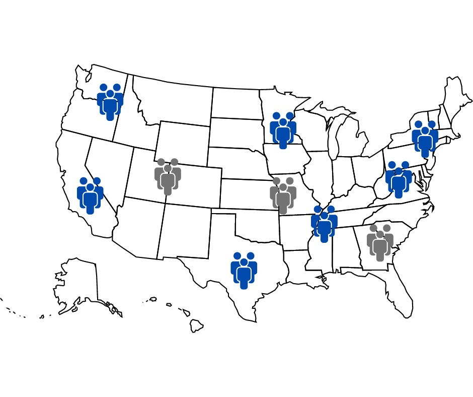

# Tempmed Staffing
## Temporary Healthcare Employee Staffing Plan

### **Objective:** 
The goal of the project was to create a staffing plan for temporary medical employees supplied to hospitals and clinics in the U.S during flu season. The staffing agency required analysis of demographic data to identify vulnerable populations and recommend decisions about where and when to send members of their limited staffing pool. The goal of the plan is to employ all available staff and  minimize understaffing across states.
### **Context:** 
The project was part of the Career Foundry curriculum to demonstrate mastery of Tableau storyboard visualization techniques: temporal visualization and forecasting, statistical visualization and spatial analysis, and presentation of findings. Advanced Excel skills included data profiling and integrity testing, data quality measures, statistical analyses, and statistical hypothesis testing.
### **Datasets**
Original datasets:
- [CDC Influenza Deaths](https://github.com/dsad8000/tempmed-staffing/blob/main/CDC_Influenza_Deaths.xlsx)
- [CDC Influenza Visits](https://github.com/dsad8000/tempmed-staffing/blob/main/CDC_Influenza_Visits.xlsx)
- [CDC Lab Tests](https://github.com/dsad8000/tempmed-staffing/blob/main/CDC_Lab_Tests.xlsx)
- [Census Population](https://github.com/dsad8000/tempmed-staffing/blob/main/Census_Population_transformed_202101.xlsx)
### Cleaned and transformed dataset:
- [Integrated Data](https://github.com/dsad8000/tempmed-staffing/blob/main/Integrated_Data.xlsx)
### **Data Limitations**
1. The main limitation in the data sets was that the CDC flu data covered only the years before 2019, so any analysis loses timeliness for application to the current flu season. 
**Based on the CDC's description of data collection processes, there is a 2-year time delay in the calculation of flu cases. The next iteration of the project would include the data from the 2021-2022 flu season to calculate future staffing requirements.**
2. Another limitation was that there were no records listed for Florida in the CDC dataset for people reporting flu-like symptoms, which represented 6% of total population reported in the U.S. Census data for the years analyzed.
**The next iteration of the project would seek to include additional data on suspected flu cases in Florida and use imputation for estimating previous years if Florida data was available. Assessment of the scheduling plan would begin immediately after plan implementation, and adjustments made based on under- and over-staffing reports across organizations and geographical region.**
3. There was also concern about underreporting of deaths from flu. Many counts were suppressed for privacy in reporting, and the mortality data did not include all months of the year.
**As with the data limitation on Florida reporting, the scheduling plan assessment would allow for real-time feedback to adjust employees provided in based on under-staffing reports.**
### **Data Exploration**
Initial analysis focused on variability in location and age. Increased age correlated strongly with increased 
incidence of flu deaths (0.8), indicating that incidence of death by seasonal flu increases with age across 
the U.S.
### **Results and Insights**
1. *Null hypothesis 1:* In states that have more suspected flu visits to providers, the providers see the same number of patients as in states with fewer suspected flu visits to providers.
  - *Alternative hypothesis 1:* In states that have more suspected flu visits to providers, the providers see the more as in states with fewer suspected flu visits to providers.
  - **At a confidence level of 95%, there is no significant difference in the number of patients seen by providers who see higher numbers of suspected flu cases and those who do not.**
2. *Null hypothesis 2:* In states that have more suspected flu visits to providers, the incidence of death from seasonal flu among people 65 years and older is the same as that in other states.
  - *Alternative hypothesis 2:* In states that have more suspected flu visits to providers, the incidence of death from seasonal flu among people 65 years and older is higher than that in other states.
  - **At a confidence level of 95%, there is a significant difference in the incidence of 
death in states that have higher numbers of suspected flu cases.**

### **Analysis**
A statistically significant relationship was found between higher flu deaths and higher number of visits to providers for evaluation of flu like symptoms
[Interim Report following hypothesis testing](https://github.com/dsad8000/tempmed-staffing/blob/main/TempMed_Staffing_Interim_Report.pdf)

!

